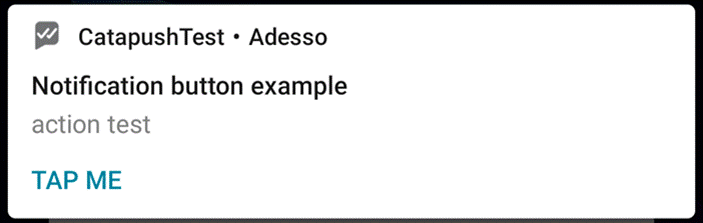
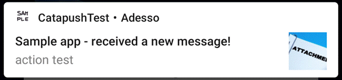
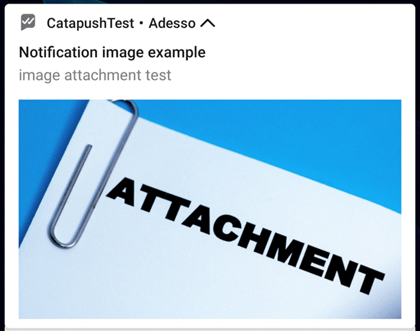

# CataPushDemo with HMS push
This guideline is from https://github.com/Catapush/catapush-docs/blob/master/AndroidSDK/DOCUMENTATION_ANDROID_SDK.md#Huawei-Push-Kit-prerequisites
## Pay attention. You MUST change the code like this:
+ Do NOT write the class "MyApplication", write a class as your Application Name, Such My Name is "CataPushDemo"
such as
```Java
public class CataPushDemo extends MultiDexApplication {
```

+ The Application Name Class import is like this
 ```Java
import android.app.NotificationChannel;
import android.app.NotificationManager;
import android.content.Context;
import android.graphics.Color;
import android.media.RingtoneManager;
import android.os.Build;
import android.util.Log;

import androidx.annotation.NonNull;
import androidx.core.content.ContextCompat;
import androidx.multidex.MultiDexApplication;

import com.catapush.library.Catapush;

import com.catapush.library.hms.CatapushHms;
import com.catapush.library.interfaces.Callback;
import com.catapush.library.notifications.NotificationTemplate;

import java.io.IOException;
import java.util.Collections;

import io.reactivex.exceptions.UndeliverableException;
import io.reactivex.plugins.RxJavaPlugins;
 ```
## in The Application Name Class, change code Boolean to Object like this
```Java
public void success(Object response) {
```

### in App/build.gradle add this in dependencies
```Java
implementation "androidx.multidex:multidex:2.0.1"//這個沒有寫
```
-------------------------------------------------
*******************************************
-------------------------------------------------

## **Notification with action button example**

The Catapush APIs and the client Catapush Android SDK "automatic" notifications doesn't support notification actions explicitly but, when the user implements their own "manual" Android notification publishing, they can provide the necessary metadata in our messaging API **optionalData** field and then using it client-side to add the actions to the notification.

Send a message with this **optionalData** field value using the Catapush messages API:

```bash
curl --request POST \
   --url https://api.catapush.com/1/messages \
   --header 'accept: application/json' \
   --header 'authorization: Bearer ACCESS_TOKEN' \
   --header 'content-type: application/json' \
   --data '{
       "mobileAppId":0,
       "text":"action test",
       "optionalData": {
            "buttonLabel": "Tap me", 
            "buttonAction": "com.example.app.INTENT_ACTION_NOTIFICATION_BUTTON"
        },
        "recipients":[{"identifier":"johndoe"}]
     }'
  
```
(you can [login here](https://www.catapush.com/quickstarts/how-to-send-a-message) to obtain the ACCESS_TOKEN and the mobileAppId values, then change the recipients identifier accordingly)

 

Then, in your test app, add this code to the Application.onCreate(...) callback after you have initialized the Catapush instance to temporarily disable the "automatic" notifications:

```java
Catapush.getInstance().init(...);
Catapush.getInstance().pauseNotifications();
```

And in your CatapushReceive.onMessageReceived(...) callback, add the following code to show the notification to the user:

```java
@Override

public void onMessageReceived(@NonNull CatapushMessage message, @NonNull Context context) {
    Intent buttonIntent = new Intent(msg.data().get("buttonAction"));
        PendingIntent buttonPendingIntent = PendingIntent
                .getActivity(context, 0, buttonIntent, PendingIntent.FLAG_ONE_SHOT);

        Notification notification = new NotificationCompat.Builder(context, context.getResources().getString(R.string.catapush_notification_channel_id))
                .setSmallIcon(R.drawable.ic_stat_notify_default)
                .setContentTitle("Notification button example")
                .setContentText(msg.previewText())
                .setStyle(new NotificationCompat.BigTextStyle().bigText(msg.body()))
                .addAction(new NotificationCompat.Action(
                        R.drawable.upsdk_third_download_bg,
                        msg.data().get("buttonLabel"),
                        buttonPendingIntent
                ))
                .build();

        NotificationManager notificationManager = (NotificationManager) context.getSystemService(context.NOTIFICATION_SERVICE);
        notificationManager.notify(msg.id().hashCode(), notification);
}
```

 

This will be the result:




## **Notification with image attachment example**

The Catapush APIs lets the customer send images as attachments to their messages.When an image is attached to a message, our backend automatically generates a thumbnail that gets delivered to the client SDK in the message itself.

To send a message with an attachment use the Catapush messages API:

```bash
curl --header 'authorization: Bearer ACCESS_TOKEN' \
 --url https://api.catapush.com/1/messages \
 -F 'metadata={"mobileAppId":0,"text":"image attachment test","recipients":[{"identifier":"johndoe"}]}' -F 'file=@attachment.jpg' 
```

(you can [login here](https://www.catapush.com/quickstarts/how-to-send-a-message) to obtain the ACCESS_TOKEN and the mobileAppId values, then change the recipients identifier accordingly)

The "automatic" SDK notifications use this thumbnail as "LargeIcon" for the Android notification if the user has not disabled this feature (see NotificationTemplate.Builder.useAttachmentPreviewAsLargeIcon(boolean)).

Result:



 

If the customer opts for the "manual" notification then he can retrieve the high resolution image from our backend and use it with the Android Notification.BigPictureStyle class.

First of all add this code to the Application.onCreate(...) callback after you have initialized the Catapush instance to temporarily disable the "automatic" notifications:

```java
Catapush.getInstance().init(...);
Catapush.getInstance().pauseNotifications();
```

And in your CatapushReceive.onMessageReceived(...) callback, add the following code to show the picture notification to the user:

```java
@Override

public void onMessageReceived(@NonNull CatapushMessage message, @NonNull Context context) {
    Glide.with(context)
            .asBitmap()
            .load(message.file().remoteUri())
            .into(new CustomTarget<Bitmap>() {
                @Override
                public void onResourceReady(@NonNull Bitmap resource, @Nullable Transition<? super Bitmap> transition) {
                    Notification notification = new NotificationCompat.Builder(context, App.CHANNEL_ID)
                            .setSmallIcon(R.drawable.ic_stat_notify_default)
                            .setContentTitle("Notification image example")
                            .setContentText(message.previewText())
                            .setStyle(new NotificationCompat.BigPictureStyle().bigPicture(resource))
                            .build();

                    NotificationManager notificationManager = (NotificationManager) context.getSystemService(NOTIFICATION_SERVICE);
                    notificationManager.notify(message.id().hashCode(), notification);
                }
                
                @Override
                public void onLoadCleared(@Nullable Drawable placeholder) {}
            });

}
```

(In the example above we have used the Glide library to simplify the image handling in Android)

 

Result:



 
